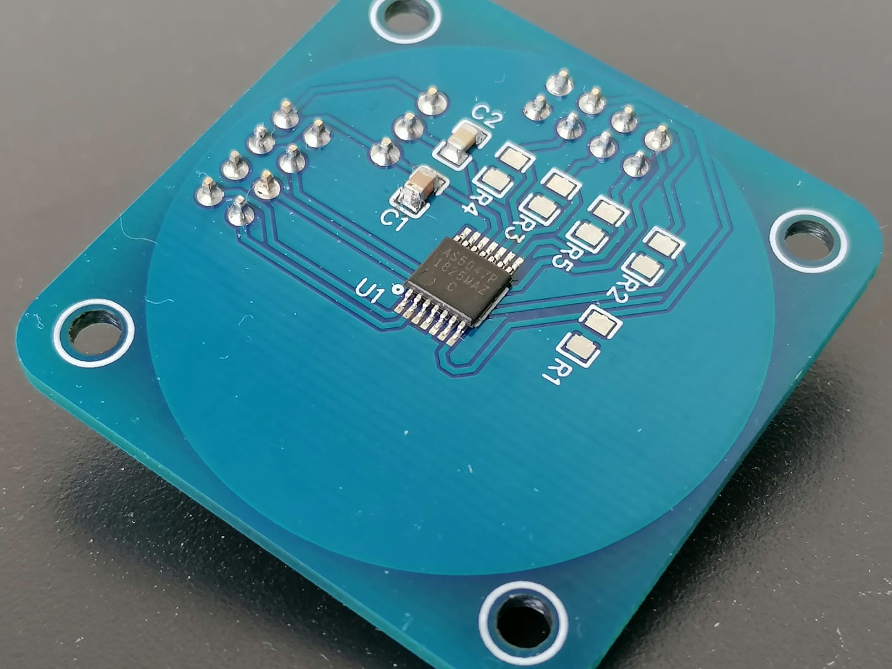
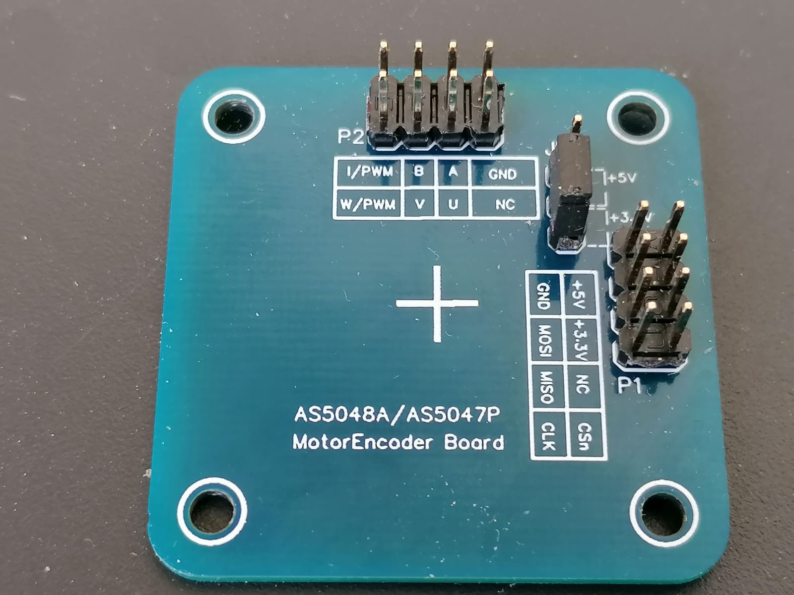

# AS5047P driver
Generic driver for AMS AS5047P magnetic encoder written in C. Because the driver was meant to be portable (platform independent), some details related to SPI communication and CS (chip-select) signals must be implemented by the user itself. This implementation takes places in file `as5047_hal.c/cpp` - 4 simple methods must be implemented - for more details check this file out. SPI and GPIO initialization is assumed to be done outside of the driver.
If you want to use AS5047P with **Arduino** or **Nucleo** - you can jump to Examples straight away, complete implementation is already done for them.

<p align="center">
  
  
</p>

## Repository Structure

* **Examples**: Driver implementations and examples
  * **General**: General example with most functions shown
  * **Arduino**: Driver implementation with an example for Arduino (tested with Teensy 3.2)
  * **Nucleo-F429ZI**: Driver implementation with an example for Nucleo-F429ZI
* **Images**: Images
* **Library**: AS5047P generic driver library  
  
## How to run library on Arduino
1. Import [example](https://github.com/CircularBuffer/AS5047P/tree/master/Examples/Arduino) to your project
2. Adjust method `AS5047P_SelectSPIAndGPIO()` in `as5047_hal.cpp` for your needs (CS pin selection)
3. Run
  
## How to run library on Nucleo (F429ZI)
1. Import [example](https://github.com/CircularBuffer/AS5047P/tree/master/Examples/Nucleo-F429ZI) to your project
2. Adjust method `AS5047P_SelectSPIAndGPIO()` in `as5047_hal.c` for your needs (CS pin selection, SPI handler selection)
3. Run
  
## How to run library on the other platforms

To make the library working with your platform you need to:
1. Import [library](https://github.com/CircularBuffer/AS5047P/tree/master/Library) to your project
2. Configure GPIO for CS signals
3. Configure SPI with these parameters:
- 	SPI MODE 1 (CPOL = 0, CPHA = 1)
- 	SCK max. 10Mhz (11.25Mhz worked also fine but not recommended)
- 	Data size: 16 bits
- 	Bits order: MSB first
- 	CS signals handled by software
4. Implement following methods from `as5047_hal.c` file:
*  `AS5047P_HAL_Delay_ms`: used for generating delay in miliseconds
*  `AS5047P_HAL_SPI_TxRx`: used for full-duplex SPI transmission
*  `AS5047P_HAL_GPIO_Write`: used for setting/clearing CS pins
*  `AS5047P_SelectSPIAndGPIO`: used for selecting SPI periphery and CS signal (see examples for Arduino/Nucleo)
*  `AS5047P_HAL_Debug`: used for debug purposes. This is an option.
5. Create encoder's instance, initialize, set zero position (calibrate) and use :
```C
// Create encoder's instance:
AS5047P_Instance encInstanceA;
// Initialize:
AS5047P_Init(&encInstanceA, 0);
// Set zero position:
AS5047P_SetZeroPosition(&encInstanceA);
// Use:
encPositionA = AS5047P_ReadPosition(&encInstanceA, AS5047P_OPT_ENABLED);
```
## Features
*  SPI communication monitoring (parity bit check)
*  SPI's slave reachibility test (by requesting non-zero value register)
*  Position value validation (magnetic field strength, CORDIC overflow, etc.) when `AS5047P_ReadPosition()` method is used.
*  Zero position calibration possible with `AS5047P_SetZeroPosition()` method.
*  Any register read/write possible with `AS5047P_ReadRegister()` and `AS5047P_WriteRegister methods`.
*  OTP burn possible

## Simple example
```C
#include "as5047p.h"

  AS5047P_Instance encInstanceA = {0};
  AS5047P_Result encPositionA;

int main(void)
{
   //--- Initialize GPIO
   //--- Initialize SPI
   
   //--- Initialize encoder and bind id number to the instance.
   AS5047P_Init(&encInstanceA, 0); // Bind encoder with id = 0

   //--- Set current encoder position as new zero (AS5047P_ZPOSL, AS5047P_ZPOSM)
   AS5047P_SetZeroPosition(&encInstanceA);

   //--- Any of the above returned error.
   if ( AS5047P_ErrorPending(&encInstanceA) )
   {
       while(1)
       {}// Sorry Joe, no luck today.
   }

   while (1)
   {
     encPositionA = AS5047P_ReadPosition(&encInstanceA, AS5047P_OPT_ENABLED);
     if( AS5047P_ErrorPending(&encInstanceA) )
     {
     	//--- Acknowledge error 
	AS5047P_ErrorAck(&encInstanceA);
     }     
     //--- Do something
   }

}
```
## All features example

```C
#include "as5047p.h"

  AS5047P_Instance encInstanceA = {0};
  AS5047P_Result encPositionA;

int main(void)
{
   //--- Initialize GPIO
   //--- Initialize SPI
   
   //--- Initialize encoder and bind id number to the instance.
   AS5047P_Init(&encInstanceA, 0); // Bind encoder with id = 0

   //--- Set registers SETTINGS1, SETTINGS2, ZPOSL, ZPOSM to their factory defaults
   //--- (in this way ignoring OTP memory loaded values).
   AS5047P_SetFactorySettings(&encInstanceA);

   //--- Set current encoder position as new zero (AS5047P_ZPOSL, AS5047P_ZPOSM)
   AS5047P_SetZeroPosition(&encInstanceA);

   //--- Change ABI resolution to 4096 Steps per revolution (ABIRES, ABIBIN)
   AS5047P_SetABIResolution(&encInstanceA, AS5047P_ABIRES_4096);

   /***************************************************************************
    * The rest of configuration is done by working directly on registers' contents.
    ***************************************************************************/

   //--- Set field UVWPP of register AS5047P_SETTINGS2 to value 3 (meaning 4 pole pairs - datasheet).
   AS5047P_SetFieldInRegister(&encInstanceA, AS5047P_SETTINGS2 , AS5047P_SETTINGS2_UVWPP, 3);

   //--- Set fields COMP_I_ERR_EN and COMP_H_ERR_EN of register AS5047P_ZPOSL to 1
   //--- (meaning: enable the contribution of MAGH and MAGL to the error flag.
   AS5047P_SetFieldInRegister(&encInstanceA, AS5047P_ZPOSL , AS5047P_ZPOSL_COMP_I_ERR_EN, 1);
   AS5047P_SetFieldInRegister(&encInstanceA, AS5047P_ZPOSL , AS5047P_ZPOSL_COMP_H_ERR_EN, 1);

   //--- Set field PWMon of register AS5047P_SETTINGS1 to 1 (meaning: turn on PWM output).
   AS5047P_SetFieldInRegister(&encInstanceA, AS5047P_SETTINGS1 , AS5047P_SETTINGS1_PWMON, 1);

   //--- Set field HYS of register AS5047P_SETTINGS2 to 3 (meaning: ...).
   AS5047P_SetFieldInRegister(&encInstanceA, AS5047P_SETTINGS2 , AS5047P_SETTINGS2_HYS, 3);

   //--- Any of the above returned error.
   if ( AS5047P_ErrorPending(&encInstanceA) )
   {
       while(1)
       {}// Sorry Joe, no luck today.
   }

   //--- Burn OTP and verify. Current content of registers
   //--- is burnt to OTP memory. Second input is enable signal,
   //--- must be 666, otherwise OTP burn WILL NOT take place.
   AS5047P_BurnOTP(&encInstanceA, 000); // Replace '000' with '666' if you're really sure to burn OTP.

   while (1)
   {
     encPositionA = AS5047P_ReadPosition(&encInstanceA, AS5047P_OPT_ENABLED);

     if( !AS5047P_ErrorPending(&encInstanceA) )
     {
		//--- Print current position
		printf("Encoder ID[%d]> Position: %d\n",AS5047P_GetID(&encInstanceA), encPositionA);
     }
     else
     {
		//--- Print error message
		printf("Encoder ID[%d]> Error %d: %s\n",AS5047P_GetID(&encInstanceA),AS5047P_GetError(&encInstanceA).errorCode, AS5047P_GetError(&encInstanceA).msg);
     }

     //--- Acknowledge error if user button pressed
     if( UserButtonPressed )
     {
		AS5047P_ErrorAck(&encInstanceA);
     }

     //--- Delay 100ms (for printf)
     delay_ms(100);
   }

}
```
